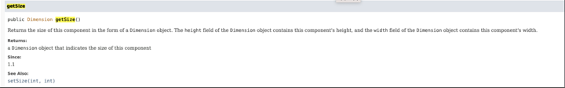
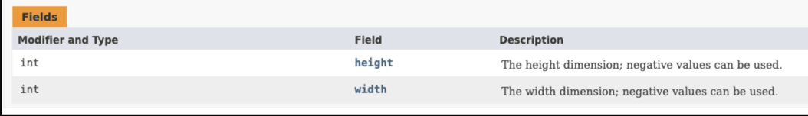
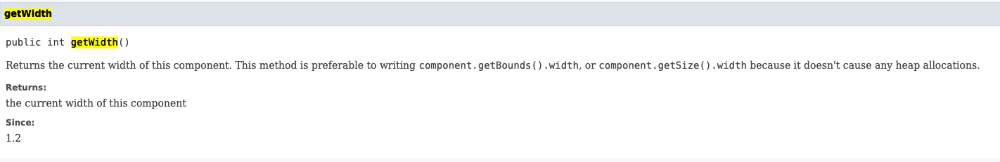
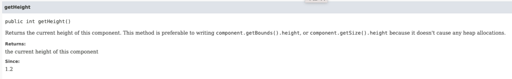
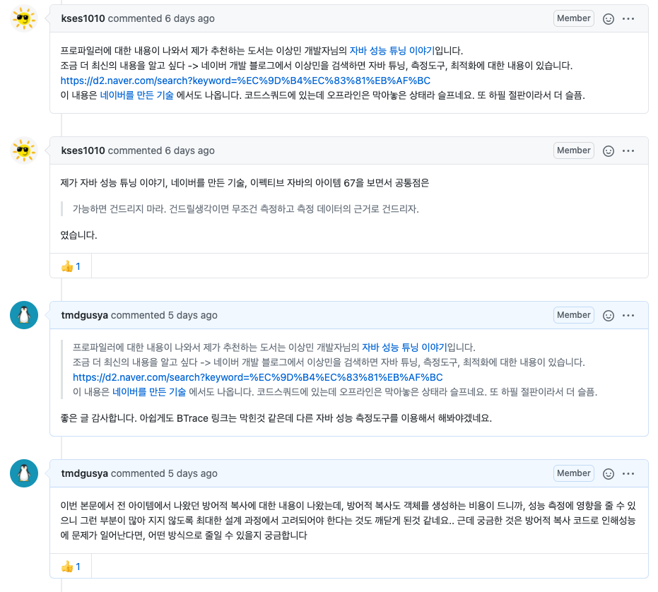
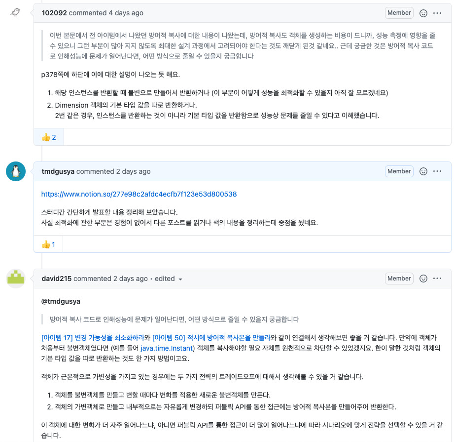
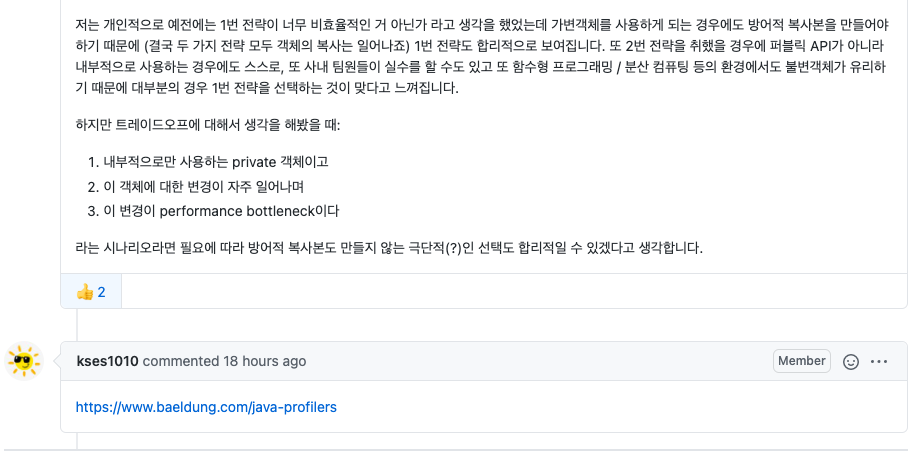

## 명언

- 최적화를 할때는 다음 두 규칙을 따르라
    - 하지마라
    - 아직 하지마라. 왼전히 명백하고 최적화된 해법을 찾기 전까지는 하지마라.

## 빠른 프로그램 보다는 좋은 프로그램을 작성하라

- 좋은 프로그램은 현재 원하는 성능이 나오지 않더라도, 좋은 아키텍쳐 그 자체가 최적화 할 수 있는 길을 안내할 수 있다. 좋은 프로그램은 정보 은닉 원칙을 따르므로, 개별 구성요소의 내부를 독립적으로 설계할 수 있다.
- **구현상의 문제는 나중에 최적화 할 수 있지만, 아키텍쳐 상의 문제는 코드를 갈아엎는 일이 나올 수 있다.**

## 가변적 복사로 인한 성능 저하

밑처럼 Component 의 getSize() 는 가변 방어적 복사가 이뤄진 Dimesion 객체를 리턴하기에 getSize() 호출시 마다, 새로운 객체를 생성해야 한다는 단점이 있음.

```java
public Dimension getSize() {
        return new Dimension(width, height);
  }
```


## Dimension

Dimension 객체는 아래와 같은 필드를 가지고 있다.

해당 Dimension 을 가변 복사 하기 보다는, 차라리 Dimension 자체의 getWidth(), getHeight() 값을 기본 타입인 int형태로 받아와서 사용하는게 낫다.



### 이러한 문제를 해결하기 위해 jdk 1.2 부터 Component 자체에 추가되었음.





## 각각의 성능 최적화 전 / 후로 성능을 측정하라

- 보통 성능을 눈에 띄게 높이지 못하는 경우가 많고, 시간을 허비하는 경우가 더 많다고 한다.
- 주요 원인은 성능 저하가 일어나는 요인을 찾기 힘들기 때문이다.
- 따라서 아래의 프로파일링 도구를 이용해서 어느 부분에서 성능 최적화를 이뤄 내야 하는지 도움을 받고 진행하는게 좋다고 한다.

## 자바 프로파일링 도구

[https://blog.naver.com/PostView.nhn?blogId=pcmola&logNo=222064546600](https://blog.naver.com/PostView.nhn?blogId=pcmola&logNo=222064546600)

위 링크를 이용하면 다운로드 받아 사용해 볼 수 있으나, 아직 프로파일링 도구를 사용할 수준은 아닌 것 같아 참고용으로 정리해 두었다.

## 회고간 나온내용

- 시간 투자대비 성능이 좋아지기 힘들다.
- 애플리케이션 자체에서는 시간 대비 튜닝이 얼마나 좋아질지도 모르며, 똑 같을 수도 있다.
    - DB 쿼리등에 비해 시간대비 투자가 좋지 않을 확률이 높다.
- 탐색 같은 경우에는 O(n) 으로 할 수 있는건, O(n^2) 으로 돌릴 수도 있으니, 이러한 부분에서 최적화가 이뤄져야 됨.

## Q&A





[자바 프로파일러 가이드 링크](https://www.baeldung.com/java-profilers)
