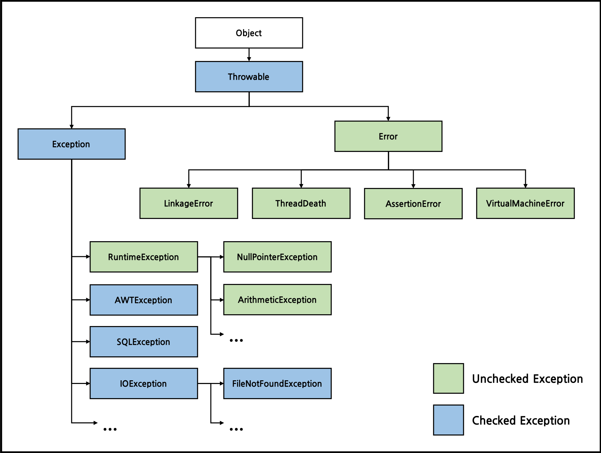

# [아이템 70] 복구할 수 있는 상황에는 검사 예외를, 프로그래밍 오류에는 런타임 예외를 사용하라

[예외처리 (throwable, exception, error, throws)](https://sjh836.tistory.com/122)

- 자바의 throwable 타입
  - Checked Exception (검사 예외)
  - Runtime Exception (런타임 예외)
  - Error

## 검사 예외 (Checked Exception)

- 호출하는 쪽에서 복구해야하만 하는 (catch 해야만 하는) Exception
- 호출하는 쪽이 catch 하거나, throws 를 통해 더 바깥으로 전파하도록 강제

## 비검사 예외 (Unchecked Exception; Error & Runtime Exception)

- 프로그램 오류; 복구가 불가능하거나 더 실행봐야 얻을 게 없음
- 클라이언트가 API 명세를 제대로 지키지 않았을 경우에 발생하는 예외
- Error 클래스를 상속하지 말고, **RuntimeException**의 하위 클래스를 활용하라
- 가능한 예외 상황을 벗어나는 데 필요한 정보를 알려주는 메서드를 함께 제공하라
  - 카드 잔고가 부족한 예외가 발생했다면, 잔고가 얼마나 부족한지 알려주는 메서드가 필요하다.

### Exception, RuntimeException, Error 를 상속하지 않는 throwable 은 만들지 말라!
