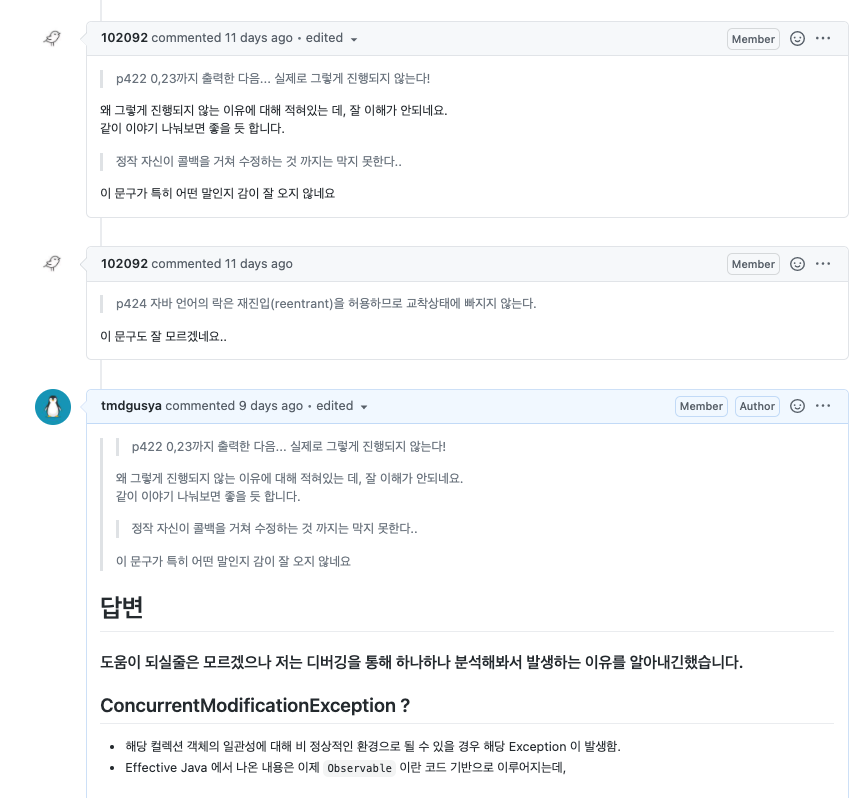
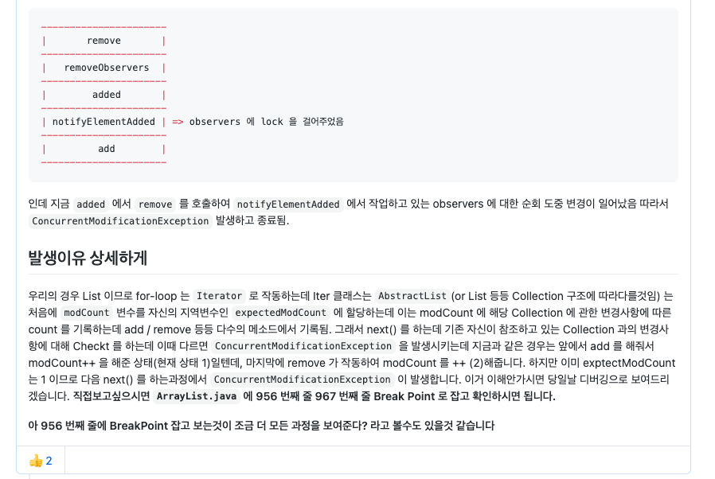
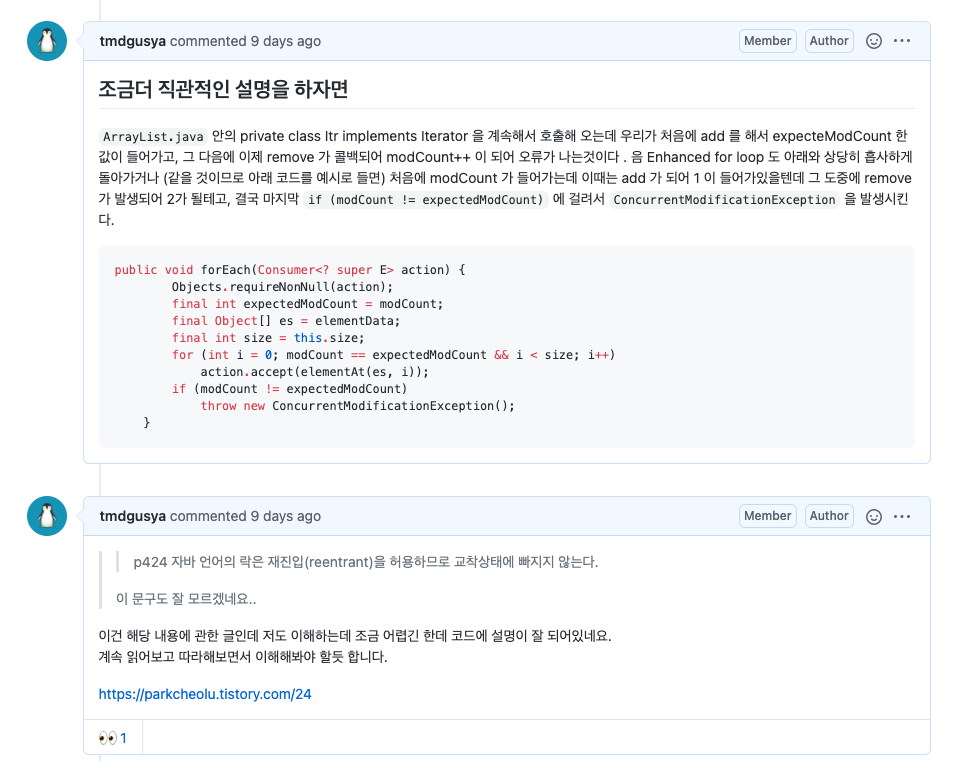

# [아이템 79] 과도한 동기화는 피하라

## Effective Java 예제

- 이제 main에서 `ObservableSet` 를 생성후 element 를 add 할때 원소가 Set 에 추가되면서 이제 `addNotifyElement` 구독자들에게 원소가 추가됬다는 사실을 알려주기 위해서 이제 callback 함수인 `added` 가 발생하는데, 근데 여기서 그 람다로 정의된 함수를 보면 아래와 같이 되어 있습니다.

```java
set.addObserver(new SetObserver<>() {
		public void added(ObservableSet<E> set, E element){
				print(element); // 귀찮아서 이렇게 적었습니다.
				if(e == 23) 
					s.removeObserver(this);
		}
});

참고 SetObservers

@FunctionalInterface
public interface SetObserver<E> {
    //Call this function when ObservableSet added element
    void added(ObservableSet<E> set, E element);
}
```

- 그니까 오류가 나는 이유를 위와 같은 상황에 빗대어 봤을때 이제 `added` 는 콜백함수이다. 근데 지금 하나의 스레드 자체는 `observers` 에 lock 을 걸고 순회중인데, 갑자기 외부에서 해당 observer 에 접근이 가능하게 된것이다. 그니까 현재 `notifyElementAdded` 가 block synchronized 구조 인데

```java
public void notifyElementAdded(E element) {
        synchronized (observers) {
            for (SetObserver<E> observer : observers) {
                observer.added(this, element);
            }
        }
    }
```

저런 구조 자체가 `added` 라는 callback 함수의 내부까지 synchronized 가 잡히지 않기 때문입니다. 실제로 진행해보면 이걸 Debugging 으로 하나하나씩 잡아보면, 처음에 add 에 들어오고 조건문을 거쳐 `notifyElementAdded` 로 가게 되고, 그 이후 observers 에 lock 을 걸고 observers 를 순회하게 되는데 이때 observer 의 added 메소드로 가게됩니다. (아직 끝나기전) 그래서 지금 메소드 스택구조를 간단하게 그려보면

```java
----------------------
|       remove       | => 이 다음 iterator 의 concurrencyException 조건문 실행
----------------------
|   removeObservers  | 
----------------------
|        added       |
----------------------
| notifyElementAdded | => observers 에 lock 을 걸어주었음
----------------------
|         add        |
----------------------
```

인데 지금 `added` 에서 `remove` 를 호출하여 `notifyElementAdded` 에서 작업하고 있는 observers 에 대한 순회 도중 변경이 일어났음 따라서 `ConcurrentModificationException` 발생하고 종료됨.

## 발생이유 상세하게

우리의 경우 List 이므로 for-loop 는 `Iterator` 로 작동하는데  Iter 클래스는 `AbstractList`(or List 등등 Collection 구조에 따라다를것임) 는 처음에 `modCount` 변수를 자신의 지역변수인 `expectedModCount` 에 할당하는데 이는 modCount 에 해당 Collection 에 관한 변경사항에 따른 count 를 기록하는데 add / remove 등등 다수의 메소드에서 기록됨. 그래서 next() 를 하는데 기존 자신이 참조하고 있는 Collection 과의 변경사항에 대해 Checkt 를 하는데 이때 다르면  `ConcurrentModificationException` 을 발생시키는데 지금과 같은 경우는 앞에서 add 를 해줘서 modCount++ 을 해준 상태(현재 상태 1)일텐데, 마지막에 remove 가 작동하여 modCount 를 ++ (2)해줍니다. 하지만 이미 exptectModCount 는 1 이므로 다음 next() 를 하는과정에서 `ConcurrentModificationException`  이 발생합니다.  이거 이해안가시면 당일날 디버깅으로 보여드리겠습니다. 직접보고싶으시면 `[ArrayList.java](http://arraylist.java)` 에 956 번째 줄 967 번째 줄 Break Point 로 잡고 확인하시면 됩니다.

## 간단 지식

Enhanced for loop 는 Itreator 를 랩핑하여 사용하는 것이다.

[ArrayList.java](http://arraylist.java) 안의 private class Itr implements Iterator<E> 을 계속해서 호출해 오는데 우리가 처음에 add 를 해서 expecteModCount 한 값이 들어가고, 그 다음에 이제 remove 가 콜백되어 modCount++ 이 되어 오류가 나는것이다 .  음 Enhanced for loop 도 아래와 상당히 흡사하게 돌아가거나 (같을 것이므로 아래 코드를 예시로 들면) 처음에 modCount 가 들어가는데 이때는 add 가 되어 1 이 들어가있을텐데 그 도중에 remove 가 발생되어 2가 될테고, 결국 마지막 `if (modCount != expectedModCount)` 에 걸려서 `ConcurrentModificationException` 을 발생시킨다.

```java
public void forEach(Consumer<? super E> action) {
        Objects.requireNonNull(action);
        final int expectedModCount = modCount;
        final Object[] es = elementData;
        final int size = this.size;
        for (int i = 0; modCount == expectedModCount && i < size; i++)
            action.accept(elementAt(es, i));
        if (modCount != expectedModCount)
            throw new ConcurrentModificationException();
    }
```

## Concurrent Collection java

- 그래서 설마 Concurrent Hash Map 은 이 modCount 를 비교하는 로직을 없애고 다른 방식을 채용한 건가? 하고 확인해보니 modCount 가 진짜로 없었다~! 이제 약간은 아 이래서 생긴거구나 라고 감이 오기 시작한것 같다. 보다 보니까 **Concurrency Level** 이란게 존재한다고 한다.

### 읽기 좋은 글

[Java ConcurrentHashMap](https://highlyscalable.blogspot.com/2014/06/java-concurrenthashmap.html)

## 재진입 ?

```java
public class Monitor{

  public synchronized out(){
    in();
  }

  public synchronized in(){
		 print("inner!");
  }
}
```

- 이 `out` 과 `in` 은 모두 Monitor 객체 this 에 대한 lock 을 시전한다.

## 참고 링크

사실 내 설명보다 아래 참조 링크 설명이 훨씬좋다. 궁금하다면 아래글을 읽어보자!

[자바의 락(Locks in Java)](https://parkcheolu.tistory.com/24)

## Alien Method

- 어제 David 의 설명 덕분에 이해가 잘갔는데 일단 내 코드를 보면서 설명하는게 빠를것 같다.

```java
@FunctionalInterface
public interface SetObserver<E> {
    //call this function when ObservableSet added element
    void added(ObservableSet<E> set, E element);
}
```

구독하는 메소드를 Functional Interface 로 받기 위해서 위와 같이 구현했다.

```java
public void addObserver(SetObserver<E> observer) {
      synchronized (observers) {
          observers.add(observer);
      }
  }
```

이제 addObserver 즉 옵저버를 추가할때 SetObserver Functional Interface 를 이용해야 한다.

그래서 이제 메인에서 아래와 같은 로직으로 돌게되는데

```java
set.addObserver(new SetObserver<Integer>() {
            @Override
            public void added(ObservableSet<Integer> s, Integer element) {
                System.out.println(element + " setObserver");
                if(element == 23) {
                    s.removeObservers(this);
                }
            }
        });
        
        for(int i = 0; i < 100; i++){
            set.add(i);
        }
```

여기서 23번 전 원소 까지는 잘되지만, 23번에서는 s.removeObservers(this); 가 발생하여 위에서 설명한 `ConcurrentModificationExceptiond` 의 조건이 충족되어 예외가 발생한다.

우리가 여기서 알 수 있는 건 함수형 인터페이스인 `SetObserver` 이 어떤 메소드인지, 구현되기 전까지 알 수 없으므로 즉 `alien Method` 가 되는 것이다.

## 책에서 말하고자 하는 바?

- **과도한 동기화를 피하라** 라는 말이 이 아이템의 제목인데, 저 말의 뜻이 우리가 기존의 동기화를 피하기 위해 사용했던 `synchronizedMap` 과 같은 것들처럼, 
  객체 자체에 락을 거는 것이 아닌, 레벨 별로 분리하여 하나의 작업 자체에서의 동기화가 이뤄지는 `CoucurrentMap` 처럼 작은 단위로서 동기화를 이뤄내라? 
  이런 뜻으로 나는 해석했다. 사실 동시성에 관한 부분은 진짜 어려워서 공룡책을 사야겠다는 생각을 처음으로 했다.

## Q&A





